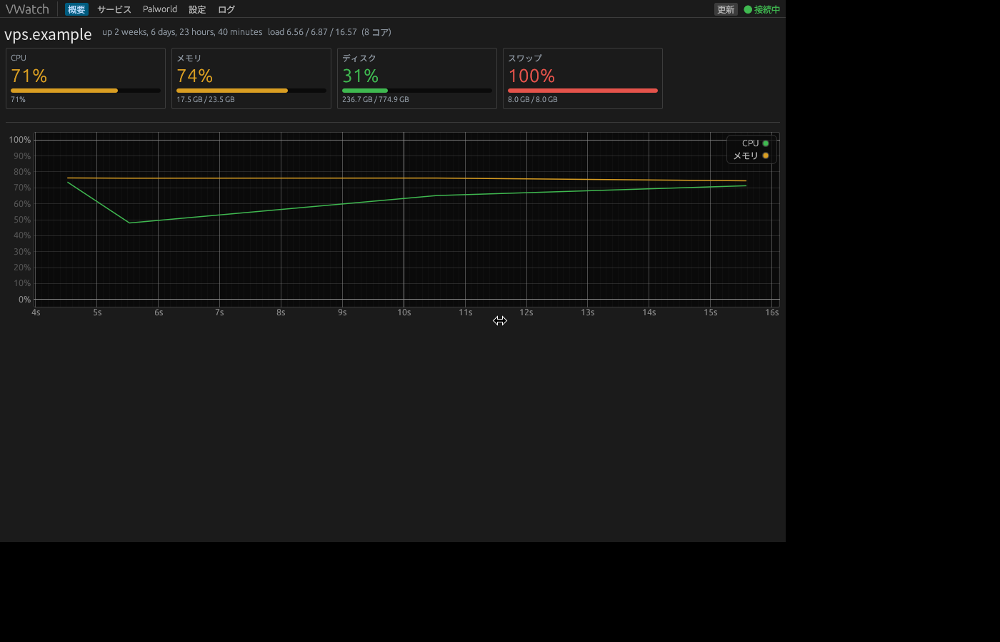
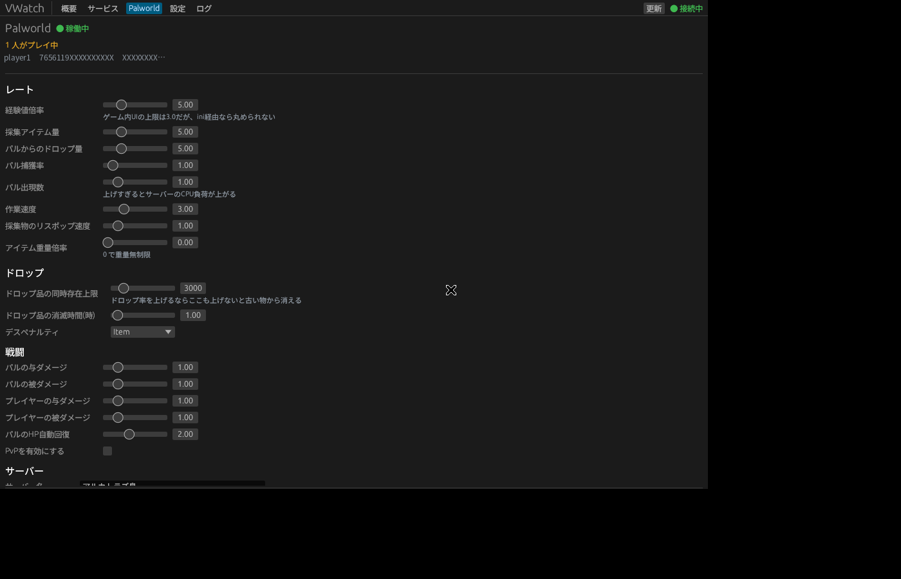

# VWatch

A Windows desktop app for watching a VPS — CPU, memory, disk, systemd units, PM2
apps — with a Palworld dedicated-server control panel on top.

Everything runs over one SSH session. Nothing is installed on the VPS.



## Install

Grab `VWatch.exe` from the [latest release](../../releases/latest), or from the
artifacts of any [build run](../../actions). It is a single self-contained exe —
no installer, no runtime.

## Setup

On first launch you land on the **設定** (Settings) tab. Fill in the host, user,
and the path to your SSH private key, then **保存して再接続**.

Settings are written to `%APPDATA%\vwatch\config.toml` — **not** to this repo.

```toml
poll_interval_secs = 5
show_pm2 = true
services = ["palworld", "playit", "cloudflared"]

[ssh]
host = "203.0.113.10"
port = 22
user = "you"
strict_host_key = false   # true once your known_hosts has the server

[ssh.auth]
kind = "key"              # or "password"
path = 'C:\Users\you\.ssh\id_ed25519'
passphrase = ""

[palworld]
enabled = true
ini_path = "/home/steam/palworld/Pal/Saved/Config/LinuxServer/PalWorldSettings.ini"
service = "palworld"
sudo = true
# Optional: a remote command printing RCON `ShowPlayers` CSV on stdout. How you
# reach RCON is host-specific (it's usually firewalled to localhost), so it's a
# config knob rather than something VWatch assumes.
players_command = ""
```

The SSH user needs passwordless `sudo` for `systemctl` and for reading/writing
the Palworld ini, since both are owned by another user.

## Palworld



The **Palworld** tab reads the live `PalWorldSettings.ini`, renders every rate as
a slider, and applies changes with a stop → edit → start cycle.

Two things worth knowing, both of which VWatch is built around:

**The server rewrites the ini on shutdown.** It dumps its in-memory config over
the file when it stops, so anything you write while it is running is silently
reverted at the next restart. VWatch therefore stops the server, waits for it to
actually exit, *re-reads* the file, patches that, writes it, and starts back up.
The pre-write copy is kept at `<ini>.vwatch.bak`.

**Rate values are not clamped to the in-game 0.5–3.0 sliders.** The world-settings
UI caps rates at 3.0, but the dedicated server does not clamp what it reads from
the ini — verified by writing `5.0`, restarting, and reading back the server's own
shutdown write-back (still `5.0`). So VWatch's sliders run well past 3.0.

Applying settings restarts the server, which disconnects everyone. The confirm
dialog tells you how many players are currently online before you commit.

## Development

```sh
cargo test              # parsers: ini, /proc/stat deltas, RCON output
cargo run -- --probe    # connect over SSH and print what the GUI would show
cargo build --release
```

`--probe` is the fastest way to diagnose a connection problem: it exercises the
whole backend with no window.

Pushing to `main` builds and uploads `VWatch.exe` as a workflow artifact. Pushing
a `v*` tag also attaches it to a GitHub Release.

## Notes

- `strict_host_key = false` skips host-key verification, which is what lets a
  fresh machine connect with no `known_hosts` entry. Turn it on once you've
  connected once.
- Japanese labels need a CJK font; VWatch loads one from the OS at startup
  (Yu Gothic / Meiryo / MS Gothic on Windows). The Settings tab shows which one
  it found.
